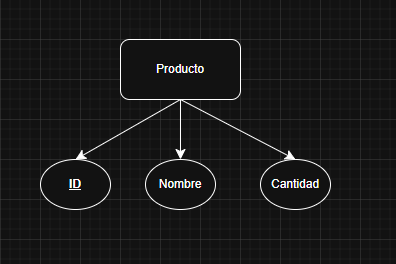
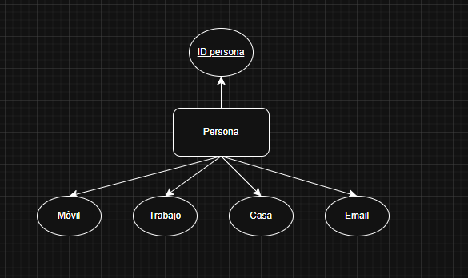
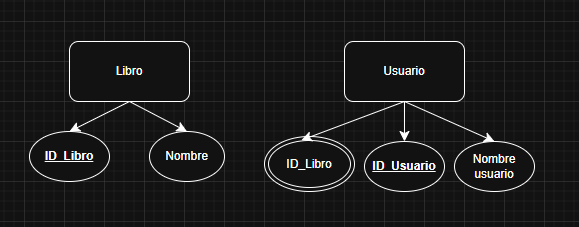
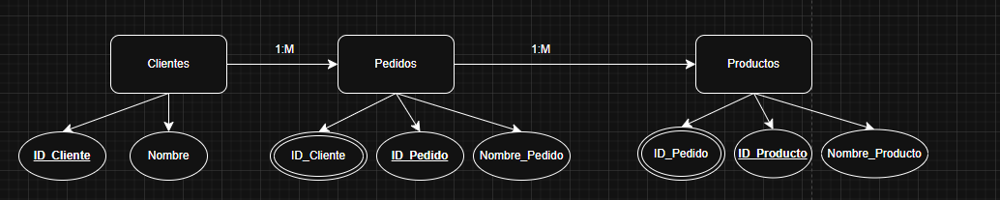
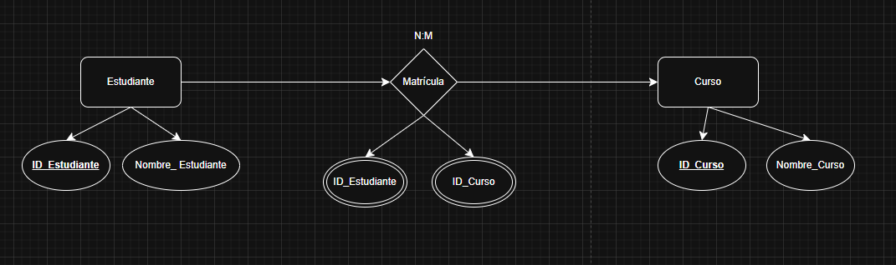
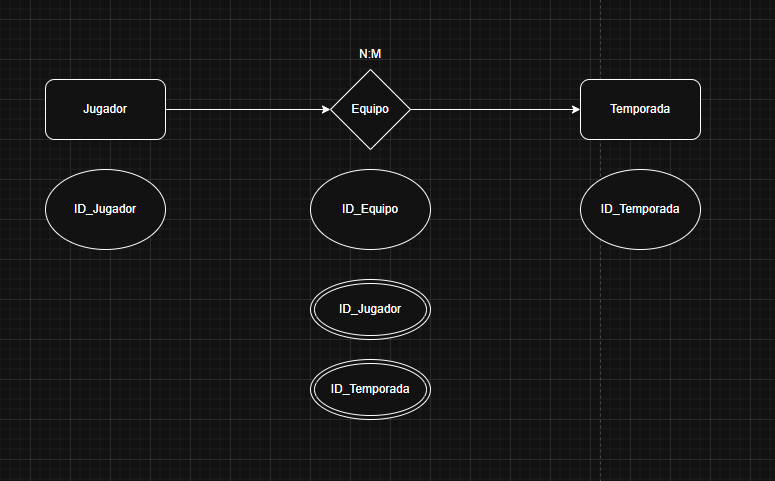
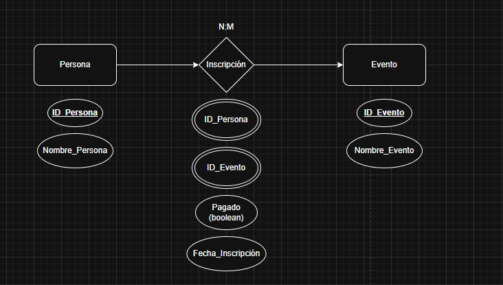

# ex01. Inventario Simple (Fácil)

## En una pequeña tienda se desea llevar un control del inventario de productos disponibles. De cada producto interesa conocer toda la información relevante para la gestión y saber cuántos hay en stock.

# ex02. Agenda de Contactos (Fácil)

## Se quiere crear una agenda de contactos personales. Una misma persona puede tener varios números de teléfono (móvil, trabajo y casa), pero cada número pertenece a una sola persona. También se almacena el correo electrónico si lo hubiera.

# ex03. Biblioteca (Fácil-Intermedio)

## Una biblioteca pública necesita gestionar los libros que posee y el registro de préstamos a usuarios. Debe poder consultar en cualquier momento qué usuario tiene qué libro y cuándo debe devolverlo.

# ex04. Tienda Online (Intermedio)

## Una tienda online necesita almacenar información sobre los productos que vende, sus clientes y los pedidos realizados. Cada pedido puede contener varios productos, y cada cliente puede realizar varios pedidos.

# ex05. Sistema Escolar (Intermedio)

## Un centro educativo quiere informatizar la gestión de sus cursos y las matrículas de los estudiantes. Cada estudiante puede apuntarse a varios cursos y un curso puede tener varios estudiantes.

# ex06. Club Deportivo (Intermedio)
  Pista: Relación N:M:M (jugador-equipo-temporada)
## Un club deportivo organiza equipos para distintas temporadas. Los jugadores pueden formar parte de diferentes equipos según la temporada. Se desea llevar un registro de qué jugador jugó en qué equipo y en qué temporada.

# ex07. Eventos y Participantes (Intermedio)

## Una empresa organiza eventos para sus clientes y empleados. Cualquier persona puede inscribirse en uno o varios eventos, y cada inscripción debe permitir registrar datos útiles para la gestión y el pago.

